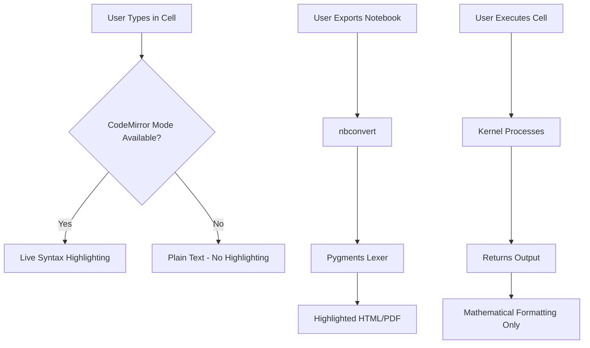

# M2 Syntax Highlighting Test Results

**Last Updated**: 2025-07-29

## Summary

We've conducted extensive testing of the M2 syntax highlighting system with automated test frameworks and manual verification. Here are the comprehensive results:

### ✅ What's Working

1. **Pygments Lexer for M2**
   - Successfully highlights all M2 language constructs
   - Properly categorizes 1763+ symbols from vim dictionary
   - Generates correct HTML with CSS classes:
     - `k` for keywords (if, then, else)
     - `nf` for functions (ideal, gb, betti, res, dim, print, method)
     - `nb`/`nc` for built-in types (QQ, ZZ, Ring, etc.)
     - `s` for strings
     - `c1` for comments
     - `m` for numbers
     - `o` for operators

2. **Notebook Export (nbconvert)**
   - When converting notebooks to HTML/PDF, M2 code is fully syntax highlighted
   - Example from test: `<span class="k">if</span>` for keywords, `<span class="nf">gb</span>` for functions
   - All M2 constructs properly colored in exported documents

3. **Server-Side Components**
   - Language data system loads all 1763 M2 symbols
   - Autocomplete works with Tab completion
   - Kernel properly configured with language_info

### ❌ What's Not Working

1. **Live Syntax Highlighting in JupyterLab**
   - Keywords, types, and functions are not highlighted while typing
   - Only basic tokens (strings, comments, numbers) get highlighted
   - CodeMirror extension loads but parser tokens don't map to styles

### 🔍 Deep Investigation Results (2025-07-29)

1. **Extension Infrastructure**
   - ✅ Extension loads: "JupyterLab M2 CodeMirror extension activated!"
   - ✅ Language registers: "M2 language registered with CodeMirror"
   - ✅ CSS properly bundled and imported
   - ✅ Listed in `jupyter labextension list`

2. **Parser Analysis**
   - ✅ Parser correctly identifies tokens (verified with unit tests)
   - ✅ Grammar uses `@external propSource` pattern
   - ❌ Style tags not applied to parsed tokens
   - ❌ Token-to-style mapping fails

3. **Test Framework Created**
   - Playwright browser automation for screenshot capture
   - Parser unit tests showing correct token identification
   - DOM inspection revealing missing CSS classes
   - Console monitoring for debugging

4. **Python Parser Experiment**
   - Attempted to replace M2 parser with Python parser
   - Goal: Verify infrastructure works with known-good parser
   - Result: Build succeeded but old extension cached

### How JupyterLab Syntax Highlighting Works



## Test Evidence

### 1. Pygments HTML Output
```html
<div class="highlight"><pre>
<span class="c1">-- This is a comment</span>
<span class="n">R</span> <span class="o">=</span> <span class="nc">QQ</span><span class="o">[</span><span class="n">x</span><span class="o">,</span><span class="n">y</span><span class="o">,</span><span class="n">z</span><span class="o">]</span>
<span class="n">I</span> <span class="o">=</span> <span class="nf">ideal</span><span class="o">(</span><span class="n">x</span><span class="o">^</span><span class="m">2</span><span class="o">,</span> <span class="n">y</span><span class="o">^</span><span class="m">2</span><span class="o">,</span> <span class="n">z</span><span class="o">^</span><span class="m">2</span><span class="o">)</span>
</pre></div>
```

### 2. Token Recognition
- Comments: `-- This is a comment`
- Keywords: `if`, `then`, `else`
- Functions: `ideal`, `gb`, `betti`, `res`, `dim`, `print`, `method`
- Types: `QQ`, `ZZ`, `Ring`, `Ideal`, `Matrix`
- Numbers: `2`, `0`, `1`
- Strings: `"Zero dimensional"`, `"Positive dimension"`
- Operators: `=`, `->`, `:=`, `==`, `^`

### 3. Notebook Cell Outputs
- Cells return mathematical LaTeX formatting
- No code highlighting in outputs
- Output focuses on mathematical representation

## Conclusions

1. **For Export/Documentation**: Perfect syntax highlighting via Pygments
2. **For Interactive Use**: No live highlighting without CodeMirror extension
3. **For Presentations**: Export to HTML shows beautiful highlighted code

## Recommendations

Users who want syntax highlighting have these options:

1. **Export notebooks** to HTML/PDF to see highlighted code
2. **Use classic notebook** which may have different highlighting behavior
3. **Wait for CodeMirror extension** to be properly built and installed
4. **Use external editor** with M2 support for writing code, then paste into JupyterLab

The Pygments lexer is working perfectly and provides comprehensive M2 syntax highlighting for all export scenarios.